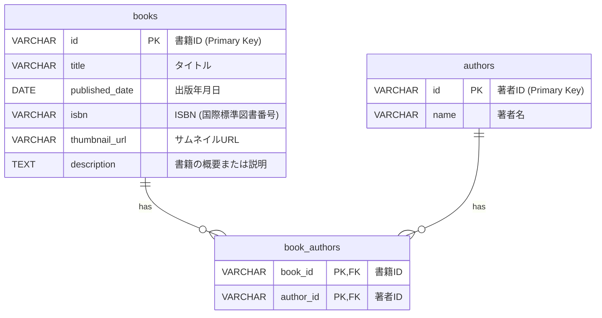

# データベース設計

## テーブル構成

```mermaid
erDiagram
    books {
        VARCHAR id PK "書籍ID (Primary Key)"
        VARCHAR title "タイトル"
        DATE published_date "出版年月日"
        VARCHAR isbn "ISBN (国際標準図書番号)"
        VARCHAR thumbnail_url "サムネイルURL"
        TEXT description "書籍の概要または説明"
    }

    authors {
        VARCHAR id PK "著者ID (Primary Key)"
        VARCHAR name "著者名"
    }

    book_authors {
        VARCHAR book_id PK,FK "書籍ID"
        VARCHAR author_id PK,FK "著者ID"
    }

    books ||--o{ book_authors : "has"
    authors ||--o{ book_authors : "has"
```
