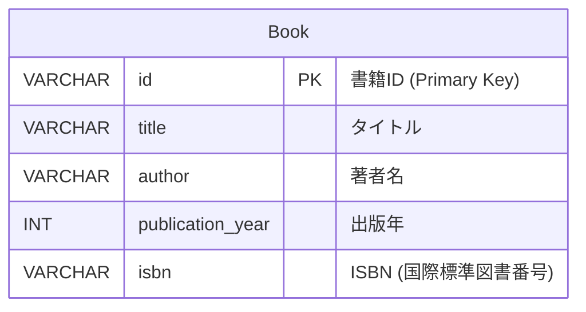

# データベース設計

## テーブル構成

```mermaid
erDiagram
    Book {
        VARCHAR id PK "書籍ID (Primary Key)"
        VARCHAR title "タイトル"
        VARCHAR author "著者名"
        INT publication_year "出版年"
        VARCHAR isbn "ISBN (国際標準図書番号)"
    }
```

